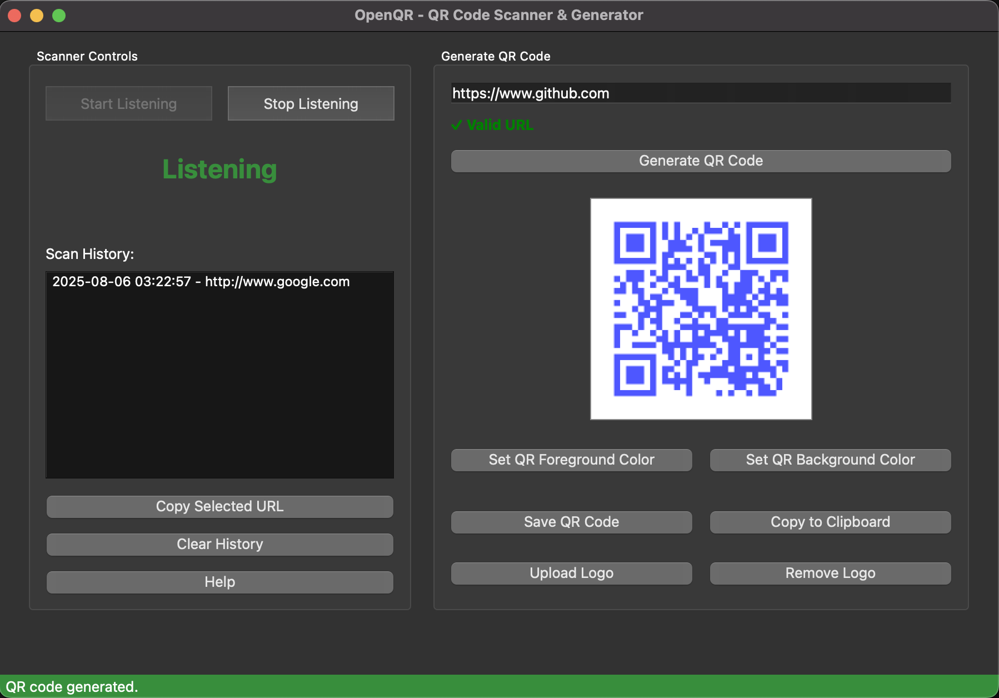

# OpenQR - QR Code Listener & URL Opener

<p align="center">
  
</p>

OpenQR is a PyQt6 application for listening to QR code scans (via HID/keyboard wedge scanners) and automatically opening URLs, with advanced customization, history, and safety features.

## Features

- Start/Stop QR code listening with real-time status indicator
- Automatically open scanned URLs in your default browser
- Scan history with timestamps, copy, and clear options (persisted across sessions)
- Domain management: allow/deny (whitelist/blacklist) lists for scanned URLs
- Preferences dialog for customizing prefix/suffix, notification type, and history size
- Upload and overlay a logo/image in the center of generated QR codes (with safe sizing and border)
- Generate QR codes with custom foreground/background colors
- Remove or reset logo overlay at any time
- Blocked domain and invalid URL warnings
- "Don't ask again for this domain" option in confirmation dialog
- Help dialog with detailed usage instructions
- All settings and history are persisted in your config directory
- Comprehensive unit tests for listener, app logic, and QR code generation

## Contributing

1. Fork the repository
2. Create a feature branch
3. Commit your changes
4. Push to the branch
5. Create a Pull Request

### Local Development

1. Clone the repository:
```bash
git clone https://github.com/yourusername/openqr.git
cd openqr
```

2. Install dependencies:
```bash
python -m venv venv
source venv/bin/activate
pip install -r requirements.txt
```

## Usage

Run the application:
```bash
make run
```

- Click the "Start Listening" button to begin detecting QR codes. When a URL is scanned, it will automatically open in your default browser (unless blocked or denied).
- Use the sidebar for scan history, status, and quick access to preferences and help.
- Access all settings and management dialogs from the menu bar.

## Development

This project uses Test-Driven Development (TDD) with pytest and pytest-qt.

Run tests:
```bash
make test
```


## Attribution

This project was developed with the assistance of [Cursor IDE](https://www.cursor.so/), an AI-powered IDE for modern Python development.

The program icon was sourced from [iconarchive.com](https://www.iconarchive.com/show/ecommerce-business-icons-by-designcontest/bar-code-icon.html) and made possible from [Design Contest](https://www.designcontest.com/).
